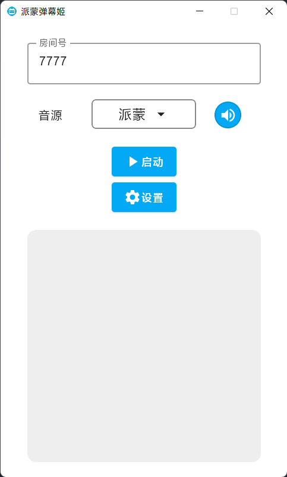

# 派蒙弹幕姬

使用原神角色合成音自动播报b站直播间弹幕.

本项目仅用于学习交流, 禁止商业用途, 侵权请联系删除!

## 功能

* [x] 自动过滤无效弹幕
* [x] 弹幕数量过多自动丢弃, 默认播报队列只有5条
* [x] 调节音量
* [ ] 自定义配置弹幕过滤功能

## 已知问题

由于上游语音合成API的问题，偶尔会有合成超时的情况

## 更新日志

###　2.0.0

- 使用kotlin进行重构，修复了断开直播间不会立即停止语音播放的问题
- 更新音源api
- 支持调整音量

## 相关项目

- [ZeroBot-Plugin](https://github.com/FloatTech/ZeroBot-Plugin)  基于ZeroBot的OneBot插件　(语音合成API来源于自项目)
- [Yabapi](https://github.com/SDLMoe/Yabapi) 一个B站第三方 Kotlin API 库
